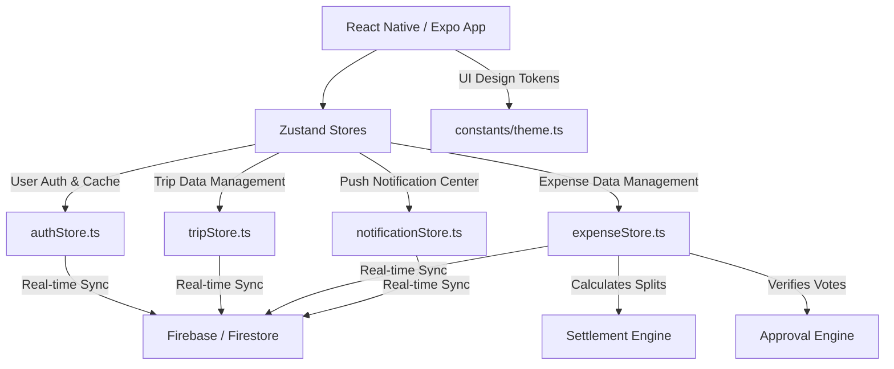

# 🚀 TripSync — Premium Group Contribution & Settlement Tracker

[](https://gkm563.github.io/TripSync/)
[](https://expo.dev/)
[](https://reactnative.dev/)
[](https://firebase.google.com/)
[](https://www.typescriptlang.org/)
[](https://github.com/pmndrs/zustand)
[](https://opensource.org/licenses/MIT)

---

## 👨‍💻 Developed By

**Gautam Kumar Maurya (gkm)**  
🚀 *Full-Stack Developer | Cyber Security Intern*  
💼 **LinkedIn:** [@gkm563](https://linkedin.com/in/gkm563)  
🐙 **GitHub:** [@gkm563](https://github.com/gkm563)  
🌐 **Portfolio Website:** [gkm563.github.io](https://gkm563.github.io)  
📧 **Email:** [gkmwin563@gmail.com](mailto:gkmwin563@gmail.com)

---

## 📖 Project Backstory & Origin

### 💡 The Spark at IIT Delhi
The idea for **TripSync** was born during an inspiring **5-day event at IIT Delhi**. Observing students, developers, and event coordinators struggling to manage group travel, lodging, and logistics highlighted a common pain point: standard split-expense apps focus on *individual split sheets*. This requires constant calculations, bill divisions, and friction points during the activity itself. There was a clear need for a mobile app focused simply on tracking **"who contributed money for the group as a whole"** to keep travel stress-free and transparent.

### 👮 Built for the Amroha Police Cyber Security Internship Program 2026 (APCSIP-2026)
This concept was turned into a production-ready React Native app during the **12-day Amroha Police Cyber Security Internship Program 2026 (APCSIP-2026)** organized by the **Amroha Police (Uttar Pradesh Police) Cyber Crime Cell**. 

During field operations, digital forensics missions, and case investigations, police officers and cyber cell teams often travel in groups and manage joint logistics (fuel, accommodation, local travel). TripSync was designed to serve as a secure, transparent, and non-hierarchical shared ledger that fits perfectly into the fast-paced, high-integrity requirements of cyber crime investigative units.

For complete day-by-day logs, selection stages, and activities during the internship (including OSINT, CDR sorting, and IPDR tracking), explore the official journal:  
📖 **[Read the Full APCSIP-2026 Cyber Security Internship Log](https://gkm563.github.io/up-police-internship.html)**

---

## 🎯 Core Product Philosophy

Unlike generic expense splitters (e.g., Splitwise) that divide every single personal item, TripSync focuses strictly on group-wide contributions:

> **"Who paid money to cover the group's collective costs?"**

### 💻 Real-World Scenario
Suppose 3 members (**Gautam**, **Rohit**, **Praveen**) are traveling:
1.  **Praveen** pays ₹600 for Train Tickets for the entire team.
    *   *TripSync records:* Praveen contributed ₹600.
2.  At the end of the trip, the total group expenditure is ₹600.
3.  Each member's share is ₹200 (₹600 / 3).
4.  **Settlement Engine** calculates:
    *   **Gautam** owes **Praveen** ₹200.
    *   **Rohit** owes **Praveen** ₹200.
    *   **Praveen** receives ₹400 back.

No micro-expenses. No complex math. Just one clean, automated settlement at completion.

---

## ✨ Key Features

*   👥 **Democratic Group Ledger:** No admins, owners, or hierarchy. All members are equal. Any member can add, edit, or vote on transactions.
*   🗳️ **Interactive Voting Approval System:** Newly added expenses are held as `Pending` until they receive a majority vote from active members. 
*   📋 **Review Queue & Dispute Resolution:** If an expense is rejected, a mandatory rejection reason is logged. The item is sent to the Review Queue for transparent team discussion.
*   🛡️ **Tamper-Proof Audit Trail:** Holds a version-controlled history of edits, votes, rejection logs, and times. Previous transaction states are kept safe.
*   🔍 **Smart Duplicate Detection:** Alerts users if a similar amount, title, and category are entered within a short time limit, reducing duplicate entries.
*   📈 **Live Decision Dashboard:** Interactive charts (using Victory Native) showing real-time breakdowns of contributions, pending actions, and net balances.
*   🚀 **Real-Time Database Sync:** Powered by Firebase Firestore for instant, low-latency state synchronization across all user devices.
*   📲 **FCM Push Notifications:** Real-time push alerts for trip invitations, new expenses, vote requests, rejections, and trip closure agreements.
*   📂 **Multi-Format Export:** Generates professional report files in **PDF**, **Excel (XLSX)**, or copyable text formats for **WhatsApp**.
*   🌙 **Premium Custom UI/UX:** Styled using a modern glassmorphic theme with a sleek dark/light mode toggle, large touch targets, and micro-animations.

---

## 🛠️ Tech Stack & Architecture

TripSync is built using a clean, modular architecture with state synchronization, client-side validation, and decoupled business logic.



### Technical Specifications
*   **Frontend Mobile Stack:** React Native (v0.81.5) via Expo SDK (v54.0.0)
*   **State Management:** Zustand (v5.0.14) for fast, lightweight global stores with local persistence.
*   **Database & Authentication:** Firebase Firestore & Firebase Auth (Google Sign-In + Email/Password).
*   **Routing & Navigation:** React Navigation (v7 Stack & Bottom Tab Navigators).
*   **Data Visualization:** Victory Native (v41.25.0) for visual expense charts.
*   **Form Management:** React Hook Form & Zod for strict client-side type-checking.
*   **Test Suite:** Jest & ts-jest for running isolated test cases.

---

## ⚡ Core Engines & Algorithms

### 1. The Settlement Engine (Minifying Transactions)
The settlement engine uses a **greedy flow-minimization algorithm** to settle group debts in the minimum possible number of transaction transfers. It calculates the net balance for each member, separates them into debtors (members who owe) and creditors (members who are owed), and systematically pairs the largest debtor with the largest creditor.

*   **File Path:** [settlementEngine.ts](file:///c:/Users/Lenovo/OneDrive/Desktop/TripSync/src/utils/settlementEngine.ts)
*   **Test Cases:** [settlementEngine.test.ts](file:///c:/Users/Lenovo/OneDrive/Desktop/TripSync/src/utils/settlementEngine.test.ts)
*   **Complexity:** $O(N \log N)$ where $N$ is the number of group members.

```typescript
// Core Settlement Calculation Loop
export function calculateSettlements(members: string[], expenses: Expense[]) {
  // 1. Calculate net contribution per member
  // 2. Average the total to find individual fair share
  // 3. Balance = Total Contributed - Total Share
  // 4. Pair debtors and creditors to minimize transactions
}
```

### 2. The Approval Engine (Majority Voting Formula)
Every expense requires team approval before being factored into the settlement engine. The creator of the expense automatically receives a positive vote (`+1`).

*   **File Path:** [approvalEngine.ts](file:///c:/Users/Lenovo/OneDrive/Desktop/TripSync/src/utils/approvalEngine.ts)
*   **Test Cases:** [approvalEngine.test.ts](file:///c:/Users/Lenovo/OneDrive/Desktop/TripSync/src/utils/approvalEngine.test.ts)
*   **Formula:**
    $$\text{Required Majority} = \lfloor \frac{\text{Total Members}}{2} \rfloor + 1$$

| Total Members | Required Votes to Approve |
| :---: | :---: |
| 3 | 2 |
| 4 | 3 |
| 5 | 3 |
| 6 | 4 |

*Note: If a member rejects an expense, a mandatory reason select menu appears (Wrong Amount, Duplicate, Wrong Category, or Other with minimum 20-character description).*

---

## 📊 Database Schema (Firestore Models)

### Trips Collections (`/trips`)
| Field | Type | Description |
| :--- | :--- | :--- |
| `id` | `string` | Unique Trip ID |
| `name` | `string` | Name of the trip |
| `coverImage` | `string` | URL to the background cover image |
| `startDate` | `string` | ISO 8601 start date string |
| `endDate` | `string` | ISO 8601 end date string |
| `members` | `string[]` | UIDs of all invited and active members |
| `status` | `'active' \| 'completed'` | The current lifecycle state of the trip |

### Sub-Collections (`/trips/{tripId}/expenses`)
| Field | Type | Description |
| :--- | :--- | :--- |
| `id` | `string` | Unique Expense ID |
| `title` | `string` | Brief description of the expense |
| `amount` | `number` | Total cost of the transaction |
| `category` | `'food' \| 'travel' \| 'hotel' \| 'shopping' \| 'other'` | Categorized type |
| `paidBy` | `Record<string, number>` | Map of member UIDs to the amount paid |
| `participants` | `string[]` | UIDs of members sharing this cost |
| `createdBy` | `string` | UID of the expense creator |
| `status` | `'pending' \| 'approved' \| 'rejected'` | Current approval state |
| `votes` | `Record<string, number>` | Map of user UIDs to their votes (`1` / `-1`) |
| `rejections` | `Record<string, string>` | Rejection reasons logged by members |
| `version` | `number` | Audit trail incremental version tracker |

---

## 🔧 Installation & Setup

To install and run the application in a local development environment:

### Prerequisites
*   Node.js (v18 or higher)
*   npm or yarn
*   **Expo Go** app installed on your physical mobile device, or Xcode/Android Studio simulator.

### Steps
1.  **Clone the Repository:**
    ```bash
    git clone https://github.com/gkm563/TripSync.git
    cd TripSync
    ```

2.  **Install Node Modules:**
    ```bash
    npm install
    ```

3.  **Setup Environment Variables:**
    Create a `.env` file in the root directory (based on `.env` file structure) and enter your Firebase parameters:
    ```env
    EXPO_PUBLIC_FIREBASE_API_KEY=your_api_key
    EXPO_PUBLIC_FIREBASE_AUTH_DOMAIN=your_auth_domain
    EXPO_PUBLIC_FIREBASE_PROJECT_ID=your_project_id
    EXPO_PUBLIC_FIREBASE_STORAGE_BUCKET=your_storage_bucket
    EXPO_PUBLIC_FIREBASE_MESSAGING_SENDER_ID=your_messaging_sender_id
    EXPO_PUBLIC_FIREBASE_APP_ID=your_app_id
    ```

4.  **Run Unit Tests:**
    Run Jest test suites to ensure settlement engine and approval formulas work perfectly:
    ```bash
    npm test
    ```

5.  **Start Development Server:**
    ```bash
    npm start
    ```
    *   Scan the QR code printed in the terminal with your **Expo Go** application (Android) or **Camera** application (iOS) to launch the app.

### 🌐 Web Application Setup & Deployment
The repository contains a fully responsive Vite-powered React marketing portal and web dashboard in the `/web` subdirectory. The live site is hosted at **[https://gkm563.github.io/TripSync/](https://gkm563.github.io/TripSync/)**.

#### 1. Setup Web Env Configuration
Create a `.env` file inside the `web/` folder with your Firebase web parameters:
```env
VITE_FIREBASE_API_KEY=your_api_key
VITE_FIREBASE_AUTH_DOMAIN=your_auth_domain
VITE_FIREBASE_DATABASE_URL=your_database_url
VITE_FIREBASE_PROJECT_ID=your_project_id
VITE_FIREBASE_STORAGE_BUCKET=your_storage_bucket
VITE_FIREBASE_MESSAGING_SENDER_ID=your_messaging_sender_id
VITE_FIREBASE_APP_ID=your_app_id
```

#### 2. Run Local Dev Server
Navigate to the web folder and launch the dev environment:
```bash
cd web
npm install
npm run dev
```

#### 3. Build Static Bundle
Generate static relative assets for deployment:
```bash
npm run build
```
Build files will be generated in `web/dist`.

#### 4. Deploy to GitHub Pages
To publish updates live:
```bash
npx gh-pages -d web/dist
```

---

## 🐛 Bugs & Refactoring Log

The following bugs and UI issues were successfully resolved:
*   **Zustand Hydration Lag:** Fixed an issue where the UI attempted to fetch data before Zustand stores were initialized, leading to temporary blank screens on startup.
*   **Active Members Cache Initialization:** Resolved an initialization issue in `tripStore.ts` where creating a new expense would fail because the active members list was read as empty during fast-load.
*   **Logout Session Data Exposure:** Implemented a total store cache flush upon user sign-out, eliminating data leakage when a different user logs in on the same device.
*   **AuthScreen Input Alignment:** Fixed layout inconsistencies and mismatched input heights on `AuthScreen` across devices with different pixel densities.

---

## 📄 License
This project is licensed under the MIT License - see the [LICENSE](file:///c:/Users/Lenovo/OneDrive/Desktop/TripSync/LICENSE) file for details.

---

⭐ *Created with ❤️ by **[Gautam Kumar Maurya](https://linkedin.com/in/gkm563)** for the **[UP Police Cyber Security Internship](https://gkm563.github.io/up-police-internship.html)** in Amroha. Show some support by starring the repository!*
