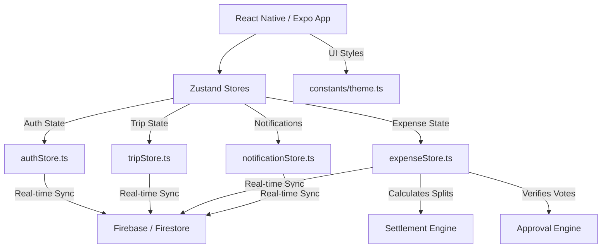

# 🚀 TripSync — Premium Group Contribution & Settlement Tracker

[](https://expo.dev/)
[](https://reactnative.dev/)
[](https://firebase.google.com/)
[](https://www.typescriptlang.org/)
[](https://github.com/pmndrs/zustand)
[](https://opensource.org/licenses/MIT)

**TripSync** is a premium, mobile-first group contribution tracking and settlement application designed for small groups (2–10 members). Whether travelling for internships, hackathons, college trips, GDG events, or shared community activities, TripSync keeps everyone aligned with real-time updates and an automated majority-voting approval system.

---

## 📖 The Origin & Backstory

### 💡 The Spark at IIT Delhi
The idea for **TripSync** was born during an inspiring **5-day event at IIT Delhi**. Seeing students, developers, and team members coordinate travel, lodging, and logistics highlighted a friction point: split-expense apps focus heavily on *individual spending*, which requires tedious calculations and constant micro-management during the trip. There was a clear need for an app that simply tracks **"who paid money for the group"** without putting individual stress on travelers.

### 👮 Developed for the UP Police Internship (Amroha)
This concept was brought to life and built as a centerpiece project for the **15-day UP Police Internship in Amroha (Uttar Pradesh)**. Designed as a real-world utility tool for groups of interns and officers executing joint projects, the application was deployed, tested, and polished to run perfectly.

*   **App Creator:** **Gautam Kumar ([gkm563](https://github.com/gkm563))**
*   **Context:** 15-Day UP Police Internship, Amroha
*   **Inspiration:** 5-Day Event, IIT Delhi

---

## 🎯 Core Product Philosophy

Unlike generic expense splitters (e.g., Splitwise) that calculate personal spending balance sheets after every coffee, TripSync operates on a single core principle:

> **"Who contributed how much money to the group as a whole?"**

### 💻 Real-World Example
Suppose 3 members (**Gautam**, **Rohit**, **Praveen**) travel together:
1.  **Praveen** pays ₹600 for Train Tickets for everyone.
    *   *TripSync records:* Praveen contributed ₹600.
2.  At the end of the trip, the total group expenditure is ₹600.
3.  Each member's share is ₹200 (₹600 / 3).
4.  **Settlement Engine** calculates:
    *   **Gautam** owes **Praveen** ₹200.
    *   **Rohit** owes **Praveen** ₹200.
    *   **Praveen** receives ₹400 back.

No complex splits during the trip. One simple settlement at the end.

---

## ✨ Key Features

*   👥 **Equal-Status Collaboration:** No admins, owners, or hierarchy. All members have equal rights to add, edit, approve, or reject expenses.
*   🗳️ **Democratic Approval System:** Every expense added goes through a real-time voting check. It is only included in final settlements once a majority of members approve.
*   🛡️ **Complete Audit Trail:** Keep a versioned history of edits, approvals, rejects, and custom rejection reasons. Nothing is permanently lost.
*   🔍 **Smart Duplicate Detection:** Alerts users if a similar amount and category are added within a short timeframe, preventing double entries.
*   📈 **Live Decision Dashboard:** Interactive charts (via Victory Native) showing real-time breakdowns of contributions, pending actions, and current balances.
*   🚀 **Real-Time Sync:** Fully integrated with Firebase Firestore for instant state synchronization across all group members.
*   📲 **Push Notifications:** Instant FCM push alerts for new expenses, approval updates, rejection reviews, and trip closure requests.
*   📂 **Multi-Format Export:** Share professional summaries via **PDF**, **Excel (XLSX)**, or simplified copy-to-clipboard formats for **WhatsApp**.
*   🌙 **Premium UI/UX:** Stunning visual aesthetics with a custom glassmorphic theme, smooth animations, and optimized touch targets for high-end mobile devices.

---

## 🛠️ Tech Stack & Architecture

TripSync is structured with modular design patterns, clean separation of concerns, and robust state management.



### Technical Blueprint
*   **Frontend Framework:** React Native (v0.81.5) via Expo (v54.0.0 SDK)
*   **State Management:** Zustand (v5.0.14) for fast, lightweight, and persistence-friendly global state.
*   **Database & Auth:** Firebase Firestore & Firebase Auth (Google Sign-In + Email Auth).
*   **Routing & Navigation:** React Navigation (v7 Stack & Bottom Tabs).
*   **Charts & Visualization:** Victory Native (v41.25.0) for beautiful expense breakdown graphs.
*   **Forms & Validation:** React Hook Form & Zod for strict type checking and client-side validation.
*   **Unit Testing:** Jest & ts-jest.

---

## ⚡ Core Engines & Algorithms

### 1. The Settlement Engine (Minifying Transactions)
The settlement engine uses a **greedy flow-minimization algorithm** to settle group debts in the fewest possible transactions. It computes net balances for each member, splits them into creditors (members owed money) and debtors (members who owe money), and systematically pairs the largest debtor with the largest creditor.

*   **Location:** [settlementEngine.ts](file:///c:/Users/Lenovo/OneDrive/Desktop/TripSync/src/utils/settlementEngine.ts)
*   **Complexity:** $O(N \log N)$ where $N$ is the number of members.

```typescript
// Core implementation logic snippet
export function calculateSettlements(members: string[], expenses: Expense[]) {
  // 1. Calculate net contribution per member
  // 2. Average the total to find individual fair share
  // 3. Balance = Total Contributed - Total Share
  // 4. Pair debtors and creditors to minimize transactions
}
```

### 2. The Approval Engine (Majority Formula)
Every expense has a status of `Pending`, `Approved`, or `Rejected`. To become `Approved`, the net voting score must reach a required majority. The creator of the expense gets an automatic `+1` vote.

*   **Location:** [approvalEngine.ts](file:///c:/Users/Lenovo/OneDrive/Desktop/TripSync/src/utils/approvalEngine.ts)
*   **Formula:**
    $$\text{Required Majority} = \lfloor \frac{\text{Total Members}}{2} \rfloor + 1$$

| Total Members | Required Votes |
| :---: | :---: |
| 3 | 2 |
| 4 | 3 |
| 5 | 3 |
| 6 | 4 |

*If an expense receives a Reject (`-1`) vote, a mandatory rejection reason is recorded. The expense is sent to the **Review Queue** where users can resolve the dispute.*

---

## 📊 Database Schema (Firestore)

### Trips (`/trips`)
| Field | Type | Description |
| :--- | :--- | :--- |
| `id` | `string` | Unique Trip ID |
| `name` | `string` | Trip Title (e.g., UP Police Internship) |
| `coverImage` | `string` | Unsplash cover image URL |
| `startDate` | `string` | ISO Date String |
| `endDate` | `string` | ISO Date String |
| `members` | `string[]` | Array of User UIDs |
| `status` | `'active' \| 'completed'` | Active status of the trip |

### Expenses (`/trips/{tripId}/expenses`)
| Field | Type | Description |
| :--- | :--- | :--- |
| `id` | `string` | Unique Expense ID |
| `title` | `string` | Title (e.g., Train Tickets) |
| `amount` | `number` | Total cost |
| `category` | `'food' \| 'travel' \| 'hotel' \| 'shopping' \| 'other'` | Category |
| `paidBy` | `Record<string, number>` | Map of UID to amount paid (supports multi-payer) |
| `participants` | `string[]` | UIDs included in this expense |
| `createdBy` | `string` | Creator's UID |
| `status` | `'pending' \| 'approved' \| 'rejected'` | Current approval state |
| `votes` | `Record<string, number>` | Map of UIs to vote values (`1` or `-1`) |
| `rejections` | `Record<string, string>` | Map of UID to rejection reason |
| `version` | `number` | Document version count |

---

## 🔧 Installation & Setup

Follow these steps to run TripSync locally:

### Prerequisites
*   Node.js (v18+)
*   npm or yarn
*   Expo Go app installed on your physical iOS/Android device, or an active simulator.

### Steps
1.  **Clone the Repository:**
    ```bash
    git clone https://github.com/gkm563/TripSync.git
    cd TripSync
    ```

2.  **Install Dependencies:**
    ```bash
    npm install
    ```

3.  **Configure Environment Variables:**
    Create a `.env` file in the root directory (based on `.env` settings) and link it to your Firebase Project:
    ```env
    EXPO_PUBLIC_FIREBASE_API_KEY=your_api_key
    EXPO_PUBLIC_FIREBASE_AUTH_DOMAIN=your_auth_domain
    EXPO_PUBLIC_FIREBASE_PROJECT_ID=your_project_id
    EXPO_PUBLIC_FIREBASE_STORAGE_BUCKET=your_storage_bucket
    EXPO_PUBLIC_FIREBASE_MESSAGING_SENDER_ID=your_messaging_sender_id
    EXPO_PUBLIC_FIREBASE_APP_ID=your_app_id
    ```

4.  **Run unit tests:**
    Ensure all logic is working correctly:
    ```bash
    npm test
    ```

5.  **Start the Expo Development Server:**
    ```bash
    npm start
    ```
    *   Scan the QR code shown in the terminal with your **Expo Go** app (Android) or **Camera app** (iOS) to load the application.

---

## 🐛 Bugs & Issues Resolved

As the app went from design to production, several key bugs were debugged and resolved:

*   **Store Initialization Lag:** Resolved a lag in the state hydration sequence where the UI would load before the Zustand store was fully initialized, causing temporary blank screens.
*   **Active Members Empty Array Bug:** Fixed a critical bug in `tripStore.ts` where creating a new expense would fail due to an empty or uninitialized `activeMembers` list.
*   **Logout Security Cache:** Implemented a full cache flush on logout, ensuring that all temporary store data (trips, expenses, profiles) is wiped to prevent data leakage between switching users.
*   **AuthScreen Input Alignment:** Unified layout heights and margins for `TextInput` boxes on `AuthScreen` to avoid rendering issues on devices with different aspect ratios.

---

## 📄 License
This project is licensed under the MIT License - see the [LICENSE](file:///c:/Users/Lenovo/OneDrive/Desktop/TripSync/LICENSE) file for details.

---

⭐ *Created with ❤️ by Gautam Kumar for the UP Police Internship in Amroha. If this project helped you, don't forget to star the repository!*
